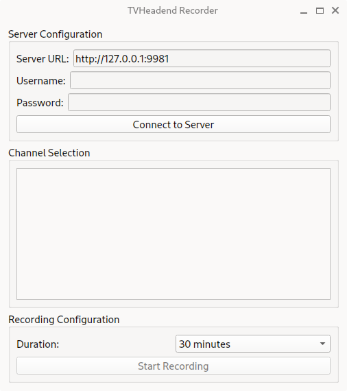

# TVHrec
A program to initiate instant recording for any channel with [TVheadend](https://tvheadend.org).

## Features: 
- Get channel list from server
- Choose duration for recording

## Download
- Head to the [releases](https://github.com/mfat/TVHrec/releases/) section to download the latest version for your operating system.

## Installation

### Linux
- Linux users should download the executable file called [tvhrec-gui](https://github.com/mfat/TVHrec/releases/latest/download/tvhrec-gui) (for commandline version see below)
- If you use Debian or Ubuntu you can also download the [deb package](https://github.com/mfat/TVHrec/releases/latest/download/tvhrec_amd64.deb) 

- Make sure it's executable `chmod +x tvhrec-gui`

- Double click the file to run it.

### Windows
- Download and run [tvhrec.exe](https://github.com/mfat/TVHrec/releases/latest/download/tvhrec.exe) from the releases section.

### GUI app for linux - manual install
Make sure python is installed.
Install rquired python modules:

- PyQt6
- requests

`pip3 install PyQt6 requests`

Download tvhrec-gui.py and run it:
`python3 tvhrec-gui.py`

### Commandline app for linux:
- If you use the deb package, both gui and cli versions are automatically installed.
- Download [tvhrec.sh](https://raw.githubusercontent.com/mfat/TVHrec/refs/heads/main/tvhrec-v2.sh) from the repo
- Make it executable `chmod +x tvhrec.sh`
- Run it with `./tvhrec.sh`

For systemwide installation:

- `sudo cp tvhrec.sh /usr/local/bin/tvhrec`
- `sudo chmod +x /usr/local/bin/tvhrec`

Now you can run `tvhrec` from anywhere.

